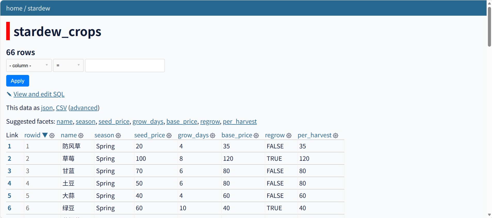
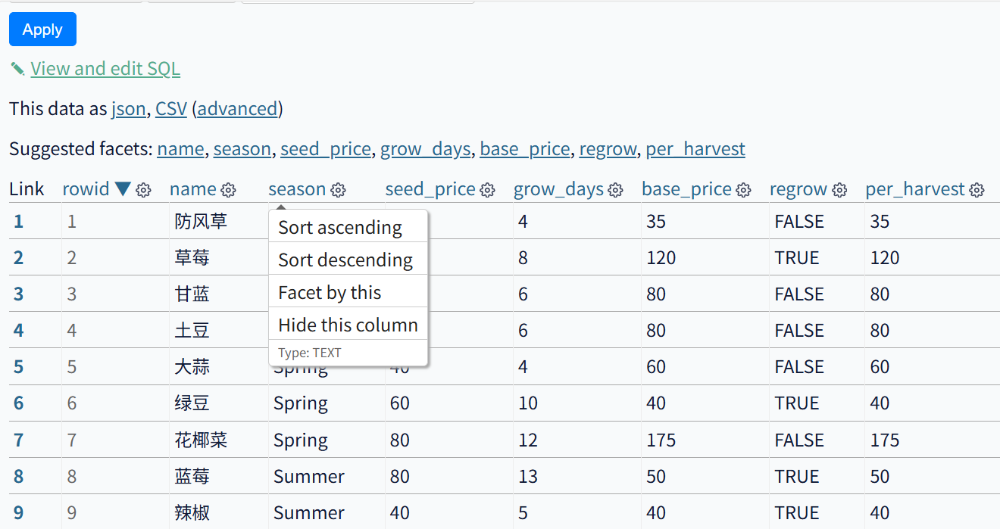
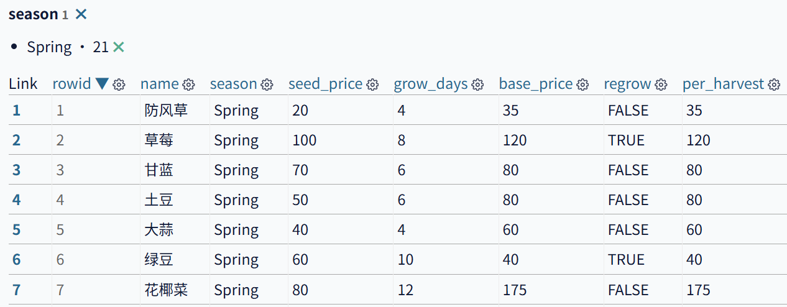
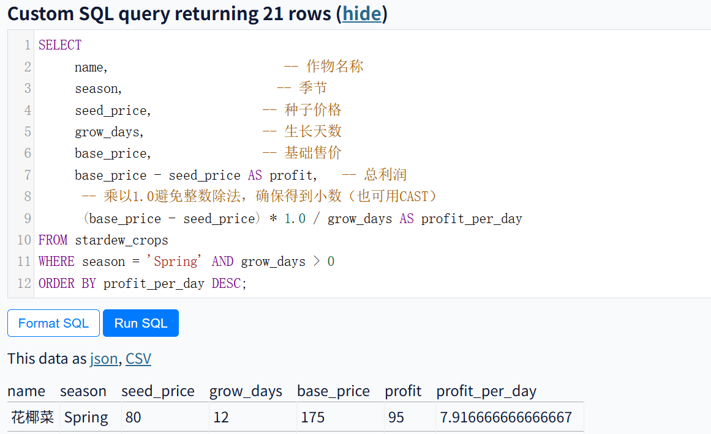

# 用 Datasette 分析星露谷物语作物利润：从零开始的场景化入门指南

> 本指南演示如何使用 Datasette 分析结构化数据，游戏数据仅作为趣味演示案例。你将掌握 Datasette 的安装与基础使用，并可将这套方法直接迁移到销售报表、实验数据等各类结构化数据的分析中。

---

## 为什么用 Datasette 而不是其他工具？

很多人会问：Excel 甚至在线表格就能分析数据，为什么还要学 Datasette？

| 工具 | 适用场景 | 局限性 |
|------|----------|--------|
| Excel / Google Sheets | 小规模数据（Excel 约 104 万行，Google Sheets 受单元格总数限制）、临时计算、图表制作 | 行数限制、无 API、操作不可复现、大数据卡顿 |
| Python (pandas) | 强大、灵活、适合复杂分析 | 需要编程基础，环境配置稍复杂 |
| **Datasette** | **中等规模数据（百万行级）、快速探索、发布 API、可复现查询** | 不适合复杂数据清洗和建模 |

Datasette 的核心优势：
- **无需传统编程语言**：安装后即可通过浏览器点击、过滤、排序、分面统计
- **API 自动生成**：每个表格和查询都自动提供 JSON API，方便他人调用
- **可复现**：SQL 查询可以保存、分享、版本控制
- **轻量快速**：基于 SQLite，单机即可处理数百万行数据

下文将带你快速上手 Datasette，一步步完成数据导入与实操分析。

---

## 一、准备数据

我们使用一份星露谷物语的作物数据（仅包含单次收获作物），包含以下列：

| 列名 | 含义 | 示例 |
|------|------|------|
| `name` | 作物名称 | 防风草 |
| `season` | 种植季节 | Spring |
| `seed_price` | 种子价格（金币） | 20 |
| `grow_days` | 生长天数（播种到首次收获） | 4 |
| `base_price` | 基础售价（普通品质） | 35 |

CSV 文件第一行为列名，后续每行为一种作物。  
[点击下载 CSV 文件](./stardew_crops.csv)（CSV 格式，约 2KB）。

> **为什么数据要转成 CSV 文件？**  
> CSV（逗号分隔值）是一种纯文本、结构简单的表格格式，几乎任何数据工具（Excel、数据库、脚本语言）都能读写。它充当了“数据交换的通用语言”——无论你的原始数据来自哪里（Excel 报表、SQL 数据库、网页导出），都可以先转换为 CSV，然后被 Datasette 统一处理。相比专有格式（如 `.xlsx`），CSV 更轻量、无版本兼容问题，并且可以轻松地用 Git 进行版本管理。

### 如果你想用自己的数据，怎么做成 CSV 文件？

- **从 Excel 转换**：打开 `.xlsx` 文件 → 文件 → 另存为 → 选择 `CSV UTF-8 (逗号分隔)` 格式。
- **从数据库导出**：使用数据库工具（如 SQLite Browser、DBeaver）导出为 CSV。
- **从在线表格导出**：Google Sheets → 文件 → 下载 → 逗号分隔值 (.csv)。
- **从其他格式转换**：使用 Python、R 或在线转换工具（如 ConvertCSV）。

确保你的 CSV 文件**第一行是列名**，且每行数据完整。

> 提示：将 CSV 文件与本文档放在同一目录下
>
> 当把本文档和后续使用CSV文件`stardew_crops.csv` 放在同一个文件夹时，文档中的相对链接 `./stardew_crops.csv` 以及后续命令行中的路径引用会更方便。这样做可以在本地执行命令时不需要输入冗长的绝对路径。

---

## 二、安装环境

### 2.1 前置环境安装（Python）

Datasette 需要 Python 3.8 或更高版本。

1. 访问 [python.org](https://www.python.org/downloads/) 下载对应系统的安装包。
2. 运行安装程序，**务必勾选 “Add Python to PATH”**。

> **如果忘记勾选“Add Python to PATH”怎么办？**  
> - **方法一（推荐）**：重新运行安装程序，选择 “Modify”，然后勾选 “Add Python to PATH”.
> - **方法二（手动）**：搜索“环境变量” → 编辑系统环境变量 → 在 `Path` 中添加 Python 安装目录（例如 `C:\...\Python312`）和 `Scripts` 子目录（例如 `C:\...\Python312\Scripts`）.  
>  **如何找到实际路径？** 打开命令行，输入 `where python`（Windows）或 `which python3`（Mac/Linux），显示的路径就是你的 Python 安装目录。

### 2.2 验证 Python 安装

打开命令行：
- **Windows**：按 `Win + R`，输入 `cmd`，回车。
- **Mac/Linux**：打开“终端”（Terminal）。

输入以下任一命令：
```bash
python --version
```
或
```bash
py --version
```
（Windows 上 `py` 通常更可靠）

正常输出示例：`Python 3.12.4`

如果提示 `'python' 不是内部或外部命令`（或 `command not found`），说明 Python 未正确添加到 PATH。请返回 [2.1](#21-前置环境安装python) 按照“忘记勾选”的方法修正。

### 2.3 升级 pip（可选但推荐）

老版本的 pip 可能导致安装失败，建议先升级：
```bash
python -m pip install --upgrade pip
```
或
```bash
py -m pip install --upgrade pip
```

### 2.4 安装 Datasette

在命令行中执行（推荐国内用户使用清华镜像源）：

```bash
pip install datasette -i https://pypi.tuna.tsinghua.edu.cn/simple
```

如果网络良好，也可以使用默认源：
```bash
pip install datasette
```

### 2.5 验证 Datasette 安装

```bash
datasette --version
```
正常输出示例：`datasette, version 0.64.8`

### 2.6 安装失败解决办法

| 错误信息 | 原因 | 解决方法 |
|---------|------|----------|
| `'pip' 不是内部或外部命令` | Python 未正确安装或 PATH 未配置 | 重新安装 Python 并勾选 “Add Python to PATH” |
| `ReadTimeoutError` | 网络超时 | 使用清华镜像源：`pip install datasette -i https://pypi.tuna.tsinghua.edu.cn/simple` |
| `Could not find a version that satisfies the requirement` | 拼写错误或 Python 版本过低 | 检查命令拼写，确保 Python ≥ 3.8 |

---

## 三、加载数据并启动服务

### 3.1 确定 CSV 文件的存放路径

将用于数据分析的csv文件 `stardew_crops.csv` 放在一个**方便访问的文件夹**，例如桌面。

**如何获得文件夹的完整路径？**
- **Windows**：打开文件夹，在地址栏点击空白处，复制显示的路径（如 `C:\Users\你的用户名\Desktop`）。或者按住 `Shift` + 右键点击 CSV 文件 → “复制文件地址”，然后去掉文件名部分。
- **Mac**：右键点击 CSV 文件 → 按住 `Option` → “拷贝路径”。

### 3.2 安装依赖工具 sqlite-utils

在**命令行**中执行（此命令不需要在特定文件夹下运行）：

```bash
pip install sqlite-utils -i https://pypi.tuna.tsinghua.edu.cn/simple
```

验证安装：
```bash
sqlite-utils --version
```
正常输出示例：`sqlite-utils, version 3.39`

**如果安装失败**：请参照 2.6 节的表格解决（通常是因为网络或 pip 版本问题）。

### 3.3 将 CSV 转换为 SQLite 数据库

**首先，确保命令行当前目录是存放 `stardew_crops.csv` 的文件夹。**

使用 `cd` 命令进入该文件夹，例如：
```bash
cd C:\Users\你的用户名\Desktop
```
（请将 `C:\Users\你的用户名\Desktop` 替换为实际文件路径，参照 3.1 即可获得）
>提示：
> - 如果路径包含空格，请用双引号包裹，例如 cd "C:\Users\Zhang San\Desktop"；
> - 如果当前不在目标盘符，先输入盘符如 D: 再执行 cd命令。

然后执行：
```bash
sqlite-utils insert stardew.db stardew_crops stardew_crops.csv --csv --encoding=utf-8-sig
```

> **参数讲解**：
> - `sqlite-utils insert`：将数据插入到 SQLite 数据库的命令。
> - `stardew.db`：要生成的数据库文件名。
> - `stardew_crops`：数据库中的表名（可以任意命名，但建议与内容相关）。
> - `stardew_crops.csv`：源 CSV 文件路径。
> - `--csv`：指明输入格式是 CSV。
> - `--encoding=utf-8-sig`：指定字符编码。Excel 保存的 CSV 常带有 BOM（Byte Order Mark），使用 `utf-8-sig` 可以自动识别并正确处理，避免第一列出现乱码（如 `\ufeffname`）。

 **为什么需要完成 CSV 至数据库的转换？**  
 Datasette 原生依托 SQLite 数据库运行，虽然新版本支持直接读取 CSV 文件但该方式运行性能薄弱、功能限制较多。
 
 额外的数据转换仅为一次性投入，完成结构化处理后，可全面提升数据分析能力：
 - 查询速度更快：SQLite 数据库比直接读 CSV 快 10–100 倍
 - 数据健壮性更强：支持索引、约束与事务机制，有效规避纯文本文件的格式错误
 - 模块耦合度更低：实现数据与分析逻辑解耦，便于后期维护与功能拓展
 - 分析可复用性高：一次性导入固化数据，重复查询无需反复预处理
 - 可完成多表关联：原生支持 JOIN 运算，实现多数据集联合分析
 - 协作可移植性高：独立数据库文件便于分享流转，统一使用环境
 - 版本管理清晰：结合原始 CSV 源文件，可完整追溯数据变更记录
 
 传统表格工具虽开箱即用，但面对百万级数据量与高频复杂筛选场景，Datasette 的结构化工作流在性能、稳定性与可维护性上优势显著。

>这条命令只需执行一次。重复执行会**覆盖**原有的 `stardew.db`。你可以利用这个性质：
> - **更新数据**：如果 CSV 文件内容有修改（比如添加了新的作物），重新运行该命令即可用最新数据覆盖旧数据库。
> - **回滚实验**：做了一些 SQL 分析后想恢复原始状态？删除 `stardew.db` 再重新转换即可。
> - **注意**：如果你对数据库做过自定义修改（如添加索引、视图或额外表），重复转换会清空这些修改，请提前备份。

### 3.4 启动 Datasette 服务

在**同一个命令行窗口**（当前目录仍为 CSV 所在文件夹）中执行：

```bash
datasette serve stardew.db
```

命令行输出类似：
```
INFO:     Started server process [12345]
INFO:     Waiting for application startup.
INFO:     Application startup complete.
INFO:     Uvicorn running on http://127.0.0.1:8001 (Press CTRL+C to quit)
```

**关键点**：
- 服务启动后，**命令行窗口会保持运行状态**，不能关闭。
- 输出中的 `http://127.0.0.1:8001` 就是你需要访问的地址。
- **如果端口 8001 被占用**：你会看到类似 `Address already in use` 或 `WinError 10048` 的错误。此时换一个端口：
  ```bash
  datasette serve stardew.db -p 8002
  ```
  访问 `http://127.0.0.1:8002`即可.

**如果关闭命令行窗口会发生什么？**  
服务会立即终止，浏览器中的页面将无法访问（显示“无法连接”）。所以请保持窗口打开直到你分析完毕。

### 3.5 浏览器访问

打开浏览器，访问命令行输出的链接（例如 `http://127.0.0.1:8001`），

进入页面后，点击 `stardew_crops` 表即可看到数据。

> 

---

## 四、找出春季最赚钱作物

> **注意**：本节中，使用 **Filter 按钮** 进行的筛选仅影响当前表格浏览视图，不会影响后面 **Execute SQL** 中的查询。SQL 查询需要自己编写 `WHERE` 条件，两者独立。

### 4.1 过滤季节（使用分面浏览）

- 找到表格中的 `season` 列，点击列名右侧的 **⚙️** 图标，选择 **Facet by this**。
- 页面**左侧**会出现分面统计结果，显示每个季节及其对应的作物数量（例如 `Spring X` 表示春季有 X 种作物）。
- **在左侧的分面统计区域中，点击 `Spring`**，表格会自动筛选，只显示春季作物。

> 

此时只显示春季作物。

> 

> **什么是分面浏览（Facet）？**  
> 分面浏览是 Datasette 的特色功能，它能自动统计某一列中不同值的出现次数，帮助你快速了解数据分布。对 `season` 列使用分面浏览后，左侧会显示每个季节有多少种作物。**点击任一季节即可一键筛选**，无需手动输入条件。  

### 4.2 利润定义

本指南仅分析**单次收获作物**（即播种后只能收获一次，如防风草、花椰菜）。  
利润 = 基础售价(`base_price`) − 种子价格(`seed_price`)

下文所指的“最赚钱”是指 **单位时间收益（每日利润）**，而非单次收获的总利润。因为生长天数短的作物即使单价低，也可能在同样时间内产生更高收益。

### 4.3 简单排序的局限性

点击 `base_price` 列标题箭头，选择**降序**，可以快速看出哪些作物售价最高。  
但这**不能反映真实利润**，因为售价高的作物种子成本也可能很高。我们需要更精确的计算。

### 4.4 使用 SQL 计算每日利润

点击顶部 **View and edit SQL** 标签，出现 SQL 编辑框。

粘贴以下代码：

```sql
SELECT 
    name,                -- 作物名称
    season,              -- 季节
    seed_price,          -- 种子价格
    grow_days,           -- 生长天数
    base_price,          -- 基础售价
    base_price - seed_price AS profit,  -- 总利润
    -- 乘以1.0避免整数除法，确保得到小数（也可用CAST）
    (base_price - seed_price) * 1.0 / grow_days AS profit_per_day
FROM stardew_crops
WHERE season = 'Spring' AND grow_days > 0
ORDER BY profit_per_day DESC;
```

**SQL 语句解释**：
- `SELECT ...`：选择要显示的列。`AS` 给计算结果起一个新列名。
- `FROM stardew_crops`：从哪张表查询（即我们导入的作物表）。
- `WHERE season = 'Spring' AND grow_days > 0`：筛选春季作物，且生长天数大于0（避免除零错误）。
- `ORDER BY profit_per_day DESC`：按每日利润从高到低排序。
- `* 1.0`：SQL 中整数除法会截断小数，乘以 1.0 强制转为浮点数，得到精确的小数结果。也可以写成 `CAST((base_price - seed_price) AS REAL) / grow_days`。

> **重要说明**：4.1中使用**Facet（分面浏览）**进行的筛选**仅影响浏览视图**，不会影响本节 **Execute SQL** 中的查询。SQL 查询是独立执行的，需要自己编写 `WHERE` 条件。两者互不干扰，你可以根据需求选择使用。

**如果想查询其他季节**：只需修改 `WHERE` 子句，例如：
- 夏季：`WHERE season = 'Summer'`
- 秋季：`WHERE season = 'Fall'`

点击 **Run SQL**，你会看到春季作物按每日利润从高到低排列。  
示例结果（实际查询会显示全部春季作物，为简洁此处只展示部分）：

| name   | season | seed_price | grow_days | base_price | profit | profit_per_day |
|--------|--------|------------|-----------|------------|--------|----------------|
| 花椰菜 | Spring | 80         | 12        | 175        | 95     | 7.92           |
| 大蒜   | Spring | 40         | 4         | 60         | 20     | 5.00           |
| 土豆   | Spring | 50         | 6         | 80         | 30     | 5.00           |
| 防风草 | Spring | 20         | 4         | 35         | 15     | 3.75           |
| 甘蓝   | Spring | 70         | 6         | 80         | 10     | 1.67           |


> 结论：花椰菜的每日利润（7.92）最高；大蒜和土豆的每日利润（5.00）表现同样优秀。

查询结果页面也提供 CSV 和 JSON 导出按钮，方便保存分析结果。
> 

---

## 五、总结与扩展

你已经学会用 Datasette 完成一个完整的数据分析流程：**安装 → 加载数据 → 过滤 → SQL 查询**。  
同样的方法可以用于任何 CSV 数据——电商销售记录、学生成绩、天气数据等。

### 游戏信息可继续扩展的方向

1. **计算可重复收获作物的利润**  
   例如草莓，生长 8 天后每 4 天收获一次。星露谷每个季节固定 28 天，可收获 `(28-8)/4 + 1 = 6` 次。总利润 = (单次售价 × 收获次数) − 种子价格。你可以为这些作物单独计算并添加到 CSV 中。

2. **筛选同季节不同天气下推荐钓鱼点位**  
   你可以收集游戏中鱼类出现的数据（地点、季节、天气、时间），然后用 Datasette 筛选出“秋季雨天”能钓到的鱼种，计算售卖价格，找出最佳钓鱼点。

3. **分析养殖动物种类如何搭配可以更快完成献祭或完美度 100%**  
   整理社区中心献祭所需的动物产品（如大鸡蛋、鸭蛋、羊奶等），以及每种动物的产出频率和条件。用 Datasette 分析需要最少饲养哪几种动物、分别养多少只，可以在最短天数内集齐所有献祭物品。

### 其他方向的应用举例

1. **网站访问日志分析**  
   导入服务器访问日志（如 Nginx 或 Apache 的 CSV 格式），使用 Datasette 快速统计不同状态码（200、404、500）的占比、IP 来源分布、请求频率最高的 URL。无需编写复杂脚本，即可排查异常流量或定位高频错误。

2. **企业轻量化办公报表**  
   汇总多部门、多季度零散业务表单，无需依赖重型办公软件。借助 Datasette 自带 API 与共享能力，快速生成可在线查阅的动态数据看板，实现团队轻量化协作。

3. **公开数据研究统计**  
   整合各类政务、行业、民生公开数据集，轻量化完成多文件合并与统一管理。依托网页端可视化浏览，随时随地自由检索、对比与深挖数据。

### 现在，你可以按需导入任意数据，自由探索分析。